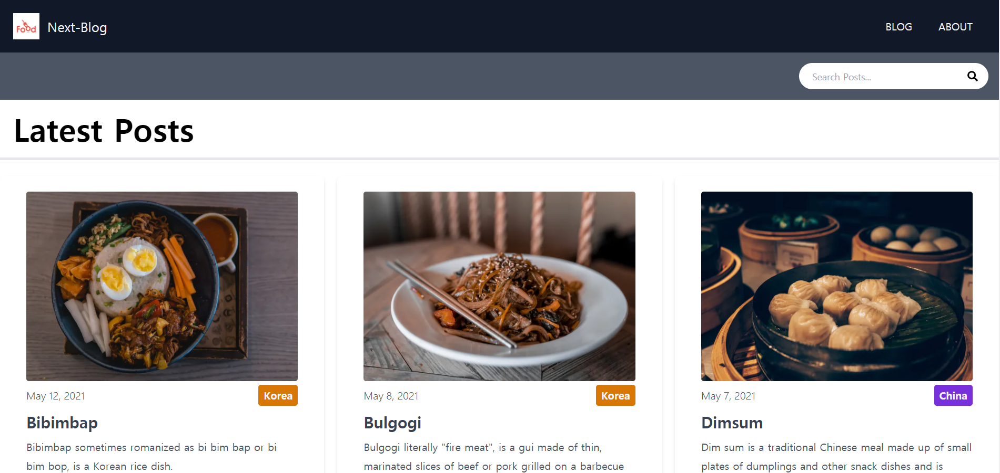

# Food-Blog


```
React.js의 프레임워크인 Next.js를 이용하여 만든 간단한 음식 블로그입니다.
TailwindCSS 프레임워크를 사용하여 디자인을 구현하였고 게시물 검색기능, 카테고리별 게시물분류 기능, 페이지네이션 등을
구현하였습니다.
```

--------------------------------------------
#### 완성된 페이지
  
--------------------------------------------

### 사용한 기술
```
- Next.js
- Next/link
- TailwindCSS
- MarkDown
```

### portfolio site
https://food-phi-seven.vercel.app/
